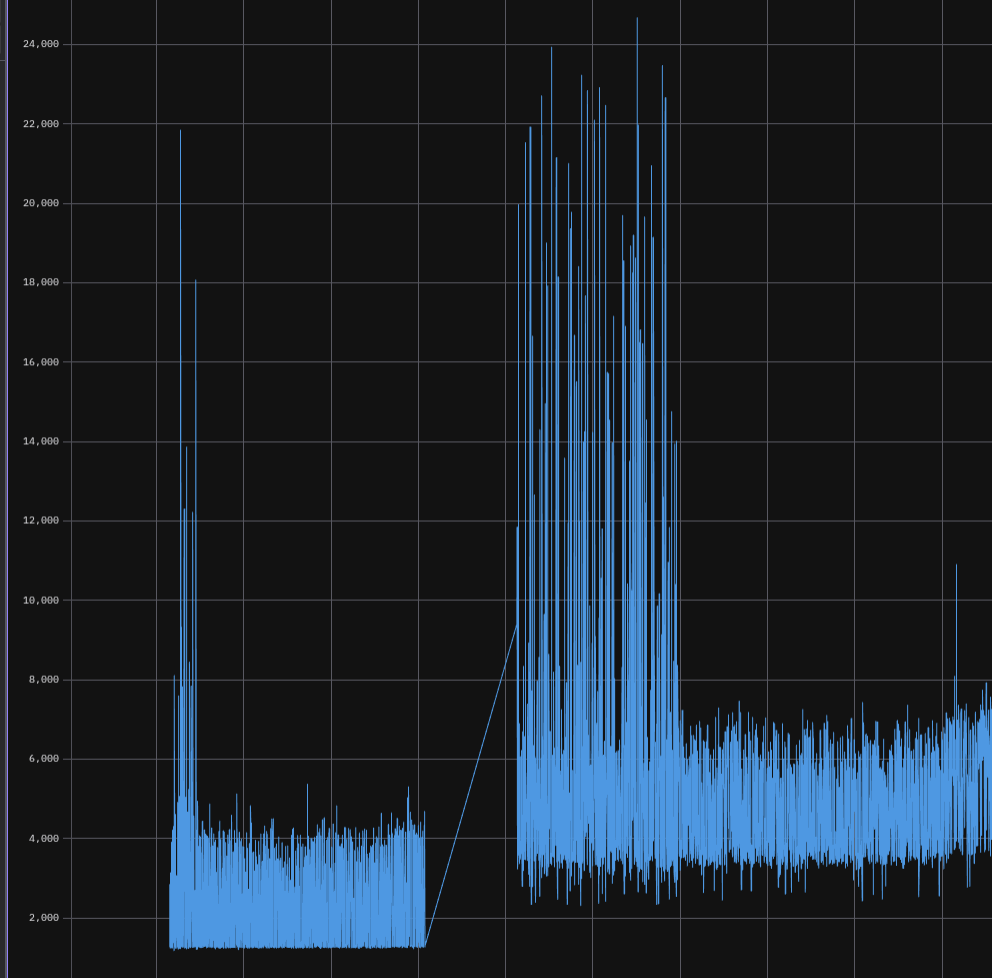

# mindvision SDK ROS2 开发记录

## 开发中，不保证可用

计划包装一层纯 `cpp` 接口, 再封装为 `ros2` 节点,现在节点处于纯测试用途

目前只支持单相机

此 ci 仅显示编译状态

[](https://github.com/marble703/MVSDK_ROS2/actions/workflows/main.yml)

## 开发/测试环境与设备
ubuntu 22.04
ros-humble
cmake 3.22.1
gcc 11.4.0

MindVision SUA133GC

## 安装方法

### ROS2

小鱼一键安装

```bash
wget http://fishros.com/install -O fishros && . fishros
```

或者

```bash
# ros-humble-desktop
echo "deb [arch=$(dpkg --print-architecture)] https://repo.huaweicloud.com/ros2/ubuntu/ $(lsb_release -cs) main" | sudo tee /etc/apt/sources.list.d/ros2.list > /dev/null
sudo apt install curl gnupg2 -y
curl -s https://gitee.com/ohhuo/rosdistro/raw/master/ros.asc | sudo apt-key add -
sudo apt update    
sudo apt install ros-humble-desktop
sudo apt install python3-argcomplete -y

# rosdep
sudo apt install python3-rosdep -y
sudo rosdep init || true
rosdep update
rosdep install --from-paths . --ignore-src -r -y
```

### mindvision-sdk

可在[这里](https://www.mindvision.com.cn/category/software/sdk-installation-package/)找到

```bash
mkdir mindvision-sdk
wget https://www.mindvision.com.cn/wp-content/uploads/2023/08/linuxSDK_V2.1.0.37.tar.gz -O mindvision-sdk/SDK.tar.gz
tar -zxvf mindvision-sdk/SDK.tar.gz --directory=mindvision-sdk
sed -i 's/usr\/include/usr\/include\/mindvision/g' mindvision-sdk/install.sh
sed -i 17a\\"mkdir -p /usr/include/mindvision" mindvision-sdk/install.sh
cd mindvision-sdk && sudo bash ./install.sh && cd ..
rm -r mindvision-sdk
```

## 录制工具

参见[RECORDER_README.md](./document/RECORDER_README.md)

## 注意事项

在快于最大 FPS 的时间间隔下读取缓冲区会读取失败，这里包装了一层，会输出上一帧代替并警告

如果出现奇怪的依赖问题，可以尝试运行 `setup_env.sh` 
该脚本会重设 python 环境，可以解决 conda 造成的 python 解释器问题

此脚本适配了 `zsh` 和 `bash`

[MindVision工业相机开发手册](
https://www.mindvision.com.cn/wp-content/uploads/2023/08/MindVision%E5%B7%A5%E4%B8%9A%E7%9B%B8%E6%9C%BA%E5%BC%80%E5%8F%91%E6%89%8B%E5%86%8C.pdf)

## 问题

1. 相机有时存在原因不明的 "预热" 效应, 如下图，在程序开始后不定时间后，帧时间抖动大幅降低。该时间在十几秒到一百秒以上不等。有时还会在启动一段时间后再次出现抖动增加再减少的现象。目前推测与上次为正确关闭相机导致缓存未释放等原因有关



2. 发布图像导致帧时间延长超过 1.5 ms

## TODO： 

原画面内录设置[](CameraSetDataDirectory/CameraSaveImage)

被动获取图像[](CameraSetCallbackFunction)和触发读取分离

白平衡设置[](CameraSetWbWindow)

硬件 ROI

更多参数接口(白平衡/饱和度/gamma/增益...)

黑白相机支持(mono sensor)

多相机支持